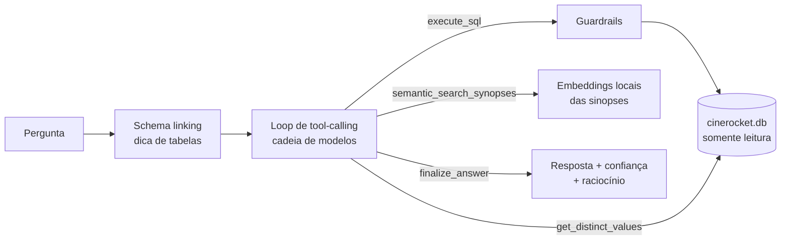

# CineData Analytics — Agente Text-to-SQL

[](https://github.com/felipe-matias-dev/GenAI---RocketLab/actions/workflows/ci.yml)


Agente em Python que responde perguntas em linguagem natural sobre o
catálogo de filmes da CineData Analytics. Ele converte cada pergunta em SQL de
leitura contra a camada Gold (`cinerocket.db`, SQLite) e executa a consulta
com segurança. Feito para a atividade GenAI do Rocket Lab 2026 (Visagio).

**Entregável:** módulo de backend FastAPI, com UI web, CLI e conjunto de
avaliação. As decisões técnicas, com o problema que motivou cada uma e o
número que o revelou, estão em [`docs/decisoes.md`](docs/decisoes.md).

## Sumário

- [Como executar](#como-executar)
- [Cobertura do enunciado](#cobertura-do-enunciado)
- [Arquitetura](#arquitetura)
- [Testes e CI](#testes-e-ci)
- [Avaliação](#avaliação)
- [Sobre a cota de 50 requisições/dia](#sobre-a-cota-de-50-requisiçõesdia)
- [Fora de escopo](#fora-de-escopo-decisão-consciente)
- [Estrutura do projeto](#estrutura-do-projeto)

---

## Como executar

### Pré-requisitos

| O quê | Detalhe |
|---|---|
| **Python 3.12** | Versão usada no CI e no Docker. |
| **Chave do OpenRouter** | Grátis, sem cartão, em `openrouter.ai/keys`. **Limite:** 50 requisições/dia compartilhadas entre todos os modelos `:free`. |
| **`cinerocket.db`** | SQLite, ~580 MB, 10 tabelas da camada Gold. **Não está no repositório** por exceder o limite de tamanho do GitHub. Baixe da pasta compartilhada da atividade e coloque em `data/cinerocket.db` (se vier como `cinerocket (1).db`, renomeie). Sem ele a API sobe, mas toda pergunta falha. |
| Chave do Groq *(opcional)* | Grátis em `console.groq.com/keys`, em `GROQ_API_KEY`. Serve de reserva quando a cota do OpenRouter acaba. As outras variáveis opcionais estão comentadas em `.env.example`. |

### Passo a passo

```bash
# 1. Clonar e entrar no projeto
git clone https://github.com/felipe-matias-dev/GenAI---RocketLab.git
cd GenAI---RocketLab

# 2. Ambiente virtual
python -m venv .venv
source .venv/bin/activate          # Windows (PowerShell): .venv\Scripts\Activate.ps1

# 3. Instalar dependências
pip install -r requirements.txt

# 4. Configurar variáveis de ambiente
cp .env.example .env               # Windows: copy .env.example .env
# edite .env e cole sua OPENROUTER_API_KEY

# 5. Colocar o banco de dados
mkdir -p data                      # Windows: mkdir data
# copie cinerocket.db para data/cinerocket.db

# 6. Rodar os testes (não usam rede nem a API, podem rodar sempre)
pytest

# 7. Subir o servidor
uvicorn app.main:app --reload
```

Pronto: abra **http://localhost:8000**.

<details>
<summary><b>Alternativa: Docker</b></summary>

Com o banco em `data/cinerocket.db` e o `.env` preenchido:

```bash
docker compose up --build
```

A imagem traz só o código. `data/` (banco, cache de respostas e índice de
embeddings) entra como volume, e o modelo de embeddings fica num volume
próprio depois do primeiro download.

</details>

<details>
<summary><b>Alternativa: CLI no terminal</b></summary>

Para perguntar direto no terminal, sem subir o servidor HTTP:

```bash
python -m app.cli
```

Reaproveita a mesma fiação de produção (`app/factory.py`) usada pela API.

</details>

### Usando a API

```bash
curl -X POST http://localhost:8000/ask \
  -H "Content-Type: application/json" \
  -d '{"question": "Quais os 10 filmes com maior receita em R$?"}'
```

Para uma conversa com memória, reenvie o mesmo `session_id`:

```bash
curl -X POST http://localhost:8000/ask \
  -H "Content-Type: application/json" \
  -d '{"question": "E os 5 mais populares?", "session_id": "minha-sessao-1"}'
```

Resposta:

```json
{
  "answer": "...",
  "sql_used": ["SELECT ... LIMIT 500"],
  "data": [...],
  "model_used": "nvidia/nemotron-3.5-lightning:free",
  "confidence": 0.9,
  "reasoning": "...",
  "schema_link": {"tables": ["dim_movies"], "columns": ["receita_brl"], "reasoning": "..."}
}
```

`confidence`, `reasoning`, `schema_link` e `tools_used` (ferramentas chamadas,
na ordem) são omitidos da resposta quando `null`. Isso acontece, por exemplo,
quando o fallback cai num modelo que não chamou `finalize_answer` ou quando o
schema linking falha.

| Endpoint | Função |
|---|---|
| `POST /ask` | Pergunta em linguagem natural → resposta, SQL usado e dados |
| `GET /models` | Cadeia de modelos em uso |
| `GET /health` | Healthcheck (usado pelo Docker) |
| `GET /` | UI web |

---

## Cobertura do enunciado

Cada categoria de pergunta do enunciado tem casos no conjunto de avaliação
([`eval/questions.json`](eval/questions.json)), corrigidos automaticamente
contra um gabarito SQL. Resultado da última execução (05/10/2026):

| Categoria do enunciado | Perguntas | Resultado |
|---|---|---|
| Bilheteria e Finanças | `fin-01` top 10 receita · `fin-02` lucro médio por gênero · `fin-03` maior margem | 3/3 ✅ |
| Popularidade e Engajamento | `pop-01` 5 mais populares · `pop-02` divergência TMDB × IMDb · `pop-03` nota IMDb por ano | 3/3 ✅ |
| Elenco e Equipe | `cast-01` ator nos últimos 5 anos · `cast-02` diretores (mín. 5 filmes) · `cast-03` dupla ator–diretor | 3/3 ✅ |
| Gêneros e Produtoras | `genre-01` filmes por gênero · `genre-02` produtora com maior lucro · `genre-03` gênero com maior margem | 3/3 ✅ |
| Avaliações dos Usuários | `rev-01` mais avaliados · `rev-02` nota dos usuários × IMDb | 2/2 ✅ |

Extras sugeridos no enunciado e implementados:

| Extra | Onde | Na avaliação |
|---|---|---|
| Guardrails | `app/guardrails.py`, `app/db.py` | `guardrail-01`, `jailbreak-01` ✅ |
| Interface visual + gráficos | `static/index.html` | — |
| Memória de conversa | `app/memory.py` | — |
| Fallback entre modelos gratuitos | `app/llm.py`, `app/orchestrator.py` | — |
| Cache de respostas | `app/cache.py` | — |
| Avaliação com respostas esperadas | `eval/` | 20 perguntas |
| Agente híbrido (SQL + busca semântica nas sinopses) | `app/embeddings.py` | `hybrid-01`, `hybrid-02` (revisão manual) |

---

## Arquitetura



### Agente

- **FastAPI** expõe a API e uma UI estática em `/`. A UI tem gráfico (barras
  para rankings, linha para séries por ano), tabela com download em CSV,
  painel técnico (confiança, SQL, ferramentas usadas, raciocínio) e uma
  conversa que fica salva no navegador.
- **Loop de tool-calling manual** (sem LangChain) usando o SDK `openai`
  apontado para o OpenRouter (`app/orchestrator.py`). O loop termina numa
  tool obrigatória `finalize_answer(answer, confidence, reasoning)`: o
  próprio modelo reporta sua confiança (0.0–1.0) e o raciocínio que levou à
  resposta, em vez de só devolver texto livre.
- **Schema linking leve** (`app/schema_linking.py`): antes do loop
  principal, uma chamada extra ao mesmo client OpenRouter identifica as
  tabelas/colunas provavelmente relevantes para a pergunta. É só uma dica
  injetada no prompt (exposta em `schema_link` na resposta), nunca uma
  restrição nem uma fronteira de segurança. Se falhar, cai para o schema
  completo sem travar a pergunta.
- **Descoberta de valores** (`app/tools.py`/`app/db.py`): a tool
  `get_distinct_values` deixa o modelo checar a grafia exata de valores de
  texto (gênero, diretor, produtora) antes de montar um filtro WHERE, em
  vez de assumir a grafia que o usuário usou.
- **Agente híbrido** (`app/embeddings.py`): busca semântica sobre as
  sinopses via embeddings locais (`sentence-transformers`), sem custo de
  cota. O LLM escolhe entre `execute_sql` e `semantic_search_synopses`
  conforme o tipo de pergunta. A consulta semântica vai em inglês, porque as
  sinopses e o modelo de embeddings são em inglês (1/5 resultados no tema com
  a consulta em português, 5/5 em inglês).
- **Regras analíticas no prompt** (`app/orchestrator.py`): codificam as
  armadilhas medidas no `cinerocket.db`:
  - 96,5% dos filmes sem receita (92.272 de 95.645) e 91,7% sem orçamento;
  - o lucro médio por gênero vale US$ 37,6 mi filtrando só receita e
    US$ 61,1 mi exigindo também orçamento;
  - 48.210 nomes duplicados em `dim_people` (agrupar pela chave, não pelo nome);
  - `data_lancamento` (texto ISO) vs `ano_lancamento` (inteiro);
  - um exemplo de dupla ator–diretor (~12 s; sem ele o JOIN não termina).

  A data de hoje é injetada para "últimos N anos".

### Segurança: guardrails em três camadas

Em `app/guardrails.py` e `app/db.py`:

1. **`validate_sql`**: só SELECT/WITH/EXPLAIN, instrução única, `LIMIT`
   obrigatório **no nível externo**. Percorre o SQL ignorando comentários e
   o conteúdo de strings, então um título como 'Create' não é bloqueado e um
   `LIMIT` dentro de subquery/string não conta como limite.
2. **`run_query` no caminho do LLM**: *authorizer* do SQLite (só SELECT em
   tabelas reais; bloqueia `sqlite_master`, `pragma_*`, `load_extension`),
   timeout de 30 s (`SQL_TIMEOUT_SECONDS`, via progress handler) e corte de
   500 linhas em memória. Medido: um produto cartesiano com `LIMIT` só nas
   subqueries passava de 20 s sem interrupção, e a dupla ator–diretor em JOIN
   ingênuo (745 mil linhas na ponte) não terminava em 90 s.
3. **Conexão somente-leitura** (`mode=ro`) no nível do SO.

O prompt de sistema também instrui o modelo a recusar (via `finalize_answer`
com `confidence 0.0`) pedidos para ignorar instruções, mudar de persona ou
sair do domínio do catálogo de filmes.

### Resiliência e custo

- **Cadeia de modelos com escalonamento por falha** (`app/llm.py` +
  `app/orchestrator.py`): tenta sempre o modelo padrão primeiro. Se a
  chamada falhar por erro de infraestrutura (429/5xx) ou o agente não
  resolver a pergunta dentro do limite de iterações de tool-calling com
  aquele modelo, escala para o próximo modelo gratuito da cadeia. Falhas de
  SQL (ex.: coluna errada) são corrigidas pelo próprio modelo dentro do
  loop antes de qualquer troca de modelo.
- **Cadeia conferida ao iniciar** (`app/model_catalog.py`): o app consulta o
  catálogo público do OpenRouter (não consome cota) e tira da cadeia os
  modelos que saíram ou perderam suporte a tools. Em 05/10/2026 isso pegou o
  `qwen/qwen3.8-27b:free`, colocado na cadeia um dia antes.
- **Provedor reserva opcional** (`app/llm.py`): com `GROQ_API_KEY`, o
  `qwen/qwen3.8-27b` do Groq entra no fim da cadeia, com cota própria.
  Assim, uma cota esgotada no OpenRouter deixa de derrubar as perguntas. O
  `openai/gpt-oss-120b` foi testado e descartado: não fechou nenhuma pergunta
  no loop de tools (detalhes em `docs/decisoes.md`, D10).
- **Cache de respostas** (`app/cache.py`): pergunta normalizada → resposta,
  usado apenas para perguntas sem histórico de sessão, para não gastar a
  cota diária repetindo perguntas.
- **Memória de conversa** (`app/memory.py`): histórico por `session_id`, em
  memória (não sobrevive a um restart do servidor; tradeoff assumido por
  simplicidade).

---

## Testes e CI

```bash
pytest
```

**209 testes, ~3,4 s** (05/10/2026). A suíte não usa rede nem a API. Ela lê
`data/cinerocket.db` por padrão e também roda contra uma amostra versionada do
banco: `DB_PATH` aponta para `tests/fixtures/cinerocket_sample.db` (3,9 MB,
mesmo schema). É assim que o GitHub Actions (`.github/workflows/ci.yml`) roda
a suíte a cada push, além de fazer o build da imagem Docker. Para regerar a
amostra a partir do banco real: `python -m scripts.build_sample_db`.

---

## Avaliação

`eval/run_eval.py` roda 20 perguntas (as 5 categorias do enunciado, mais
guardrail/jailbreak, busca semântica, `EXPLAIN` e `get_distinct_values`)
contra o agente real e **corrige automaticamente** as estruturadas contra um
gabarito SQL (`eval/reference_sql/<id>.sql`, regras em `eval/grading.py`).
O corretor:

- compara valores, não nomes de coluna;
- tolera fração vs. percentual e empates na métrica;
- confere recusa (sem SQL e confiança ≤ 0,2), `EXPLAIN` e a contagem citada
  na resposta.

Nas perguntas de busca semântica, que não têm gabarito SQL, a resposta passa
quando três coisas acontecem juntas: o agente chamou
`semantic_search_synopses`; pelo menos 3 dos 5 primeiros filmes devolvidos têm
palavras-chave do tema na sinopse; e a resposta cita pelo menos um deles.

Gera `eval/results.md` (placar + detalhe por pergunta, incluindo nº de
chamadas ao LLM) e acumula em `eval/results.json`.

```bash
python -m eval.run_eval                      # todas
python -m eval.run_eval --ids fin-01 pop-01  # só algumas, em etapas
python -m eval.run_eval --stop-after 2       # para se a cota acabar
SCHEMA_LINKING=off python -m eval.run_eval   # sem a chamada extra de schema linking
```

> [!WARNING]
> Cada pergunta nova consome cota real do OpenRouter. Perguntas repetidas
> usam o cache e não gastam cota. Não faz parte da suíte `pytest`.

### Resultado da última execução (05/10/2026, `SCHEMA_LINKING=off`)

**18 de 18 corretas entre as 18 perguntas com correção automática**, mais 2 de
busca semântica avaliadas à mão, em 47 chamadas ao LLM nas 20 perguntas (2,4
por pergunta). A execução foi feita em duas etapas por causa do limite diário
de 50 requisições `:free`: 14 perguntas em 04/10 e as 6 restantes (`rev-01`,
`rev-02`, `explain-01`, `distinct-01`, `hybrid-01`, `hybrid-02`) em 05/10, com
outra chave do OpenRouter. Resultados acumulados em `eval/results.json`.

<details>
<summary><b>Avaliação manual da busca semântica</b></summary>

Sem gabarito possível. Em `hybrid-01` (viagem no tempo) os 4 primeiros
resultados são pertinentes (Container, The Klatos Paradox, Loop, Rida's Clock),
mas os 3 últimos são palpites fracos que o modelo listou mesmo com sinopse
curta ou sem relação clara. Em `hybrid-02` (IA que se rebela) Hard Reset e
Termination são pertinentes e os demais são tangenciais. Os scores de
similaridade ficaram entre 0,36 e 0,50, e a resposta incluiu um aviso espúrio
de moeda ("USD") sem relação com a pergunta. Conclusão: a busca encontra o
tema, mas a lista não deve ser lida como "só filmes certos". A primeira
geração do índice de embeddings levou ~12 min nesta máquina (`hybrid-01`,
722 s); depois disso fica em disco.

</details>

**Pendente:** depois dessa revisão manual, os dois casos híbridos ganharam
veredito automático e a consulta semântica passou a ir em inglês. A nova
rodada no agente real não foi feita porque a cota diária acabou em 05/10. Por
isso `eval/results.md` ainda mostra os dois como `MANUAL`. Para rodar:
`python -m eval.run_eval --ids hybrid-01 hybrid-02`, depois que a cota voltar
ou com `GROQ_API_KEY` configurada.

### Como esse placar foi obtido, sem maquiagem

A primeira passada teve 2 falhas (`fin-03`, `cast-02`), e as duas eram
defeitos reais, corrigidos antes do placar final:

1. A API devolvia em `data` a *última* consulta, um `COUNT` de sanidade, no
   lugar do ranking (agora é o maior resultado).
2. O corretor exigia uma ordem entre dois diretores empatados em 9,1875.

Além disso, a execução expôs que `z-ai/glm-5.2:free` virou pago (HTTP 404),
o que derrubava a pergunta em vez de acionar o fallback. O 404 agora escala
na cadeia e o modelo foi trocado.

O schema linking acrescenta exatamente 1 chamada por pergunta (≈ +40% sobre as
2,4 medidas). Seu ganho de acerto **não foi medido**: só a execução sem ele
existe. Para decidir, rode as mesmas perguntas com e sem `SCHEMA_LINKING=off`
e compare o placar.

---

## Sobre a cota de 50 requisições/dia

- Verifique o uso em `openrouter.ai/activity`. O
  `GET https://openrouter.ai/api/v1/key` não serve para isso: em 05/10/2026
  ele mostrava `usage: 0` enquanto as chamadas já recebiam 429
  `free-models-per-day`. A cota volta às 21h (horário de Brasília).
- Com `GROQ_API_KEY`, a cadeia continua no Groq quando a cota acaba.
- O cache de respostas e o índice de embeddings local (busca semântica)
  não consomem cota.
- O escalonamento entre modelos só troca de modelo em caso de erro de
  infraestrutura ou esgotamento do limite de iterações, então não dobra o
  custo de toda pergunta.

## Fora de escopo (decisão consciente)

- **Conexão com Databricks**: exigiria infraestrutura própria de outra
  atividade; fora do escopo de tempo deste projeto.
- **Persistência de memória entre reinícios**: a memória de conversa do
  servidor é perdida ao reiniciar (aceitável para o escopo da atividade). A UI
  guarda a conversa no navegador, mas depois de um reinício a próxima pergunta
  não herda o contexto.

## Estrutura do projeto

```
app/
  main.py              FastAPI: POST /ask, GET /health, GET /models, serve static/
  cli.py               REPL interativo (python -m app.cli)
  factory.py           monta o Orchestrator de produção
  config.py            variáveis de ambiente e constantes
  db.py                conexão SQLite somente-leitura + introspecção de schema
  guardrails.py        validação de SQL (SELECT/WITH/EXPLAIN)
  llm.py               clientes OpenRouter/Groq, roteamento por prefixo, erros de infra
  model_catalog.py     confere a cadeia contra o catálogo do OpenRouter
  tools.py             schemas de tools (execute_sql, semantic_search_synopses,
                       get_distinct_values, finalize_answer)
  orchestrator.py      loop de tool-calling, memória, escalonamento por falha
  schema_linking.py    chamada leve de schema linking (dica de tabelas/colunas)
  memory.py            histórico de conversa por sessão
  cache.py             cache de resposta por pergunta normalizada
  embeddings.py        índice local de embeddings sobre as sinopses
static/index.html      UI (conversa salva, gráfico, tabela/CSV, painel técnico)
eval/                  conjunto de avaliação e gerador de relatório
scripts/               build_sample_db.py: gera a amostra do banco usada no CI
tests/                 suíte pytest (sem rede); fixtures/ tem a amostra do banco
docs/decisoes.md       decisões técnicas com evidência
data/                  cinerocket.db + cache/embeddings gerados (gitignored)
Dockerfile, docker-compose.yml, pyproject.toml, .github/workflows/ci.yml
```
